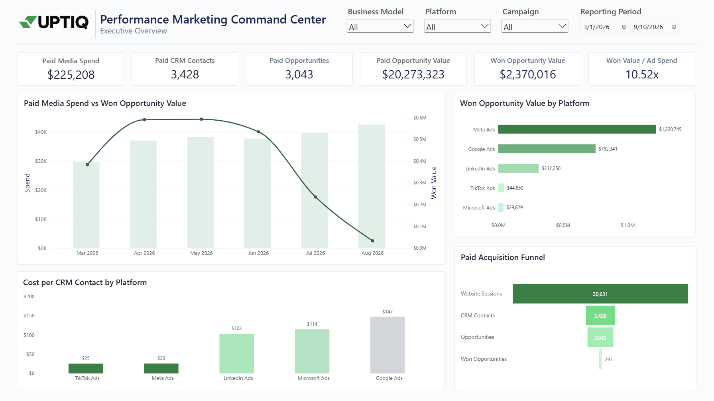
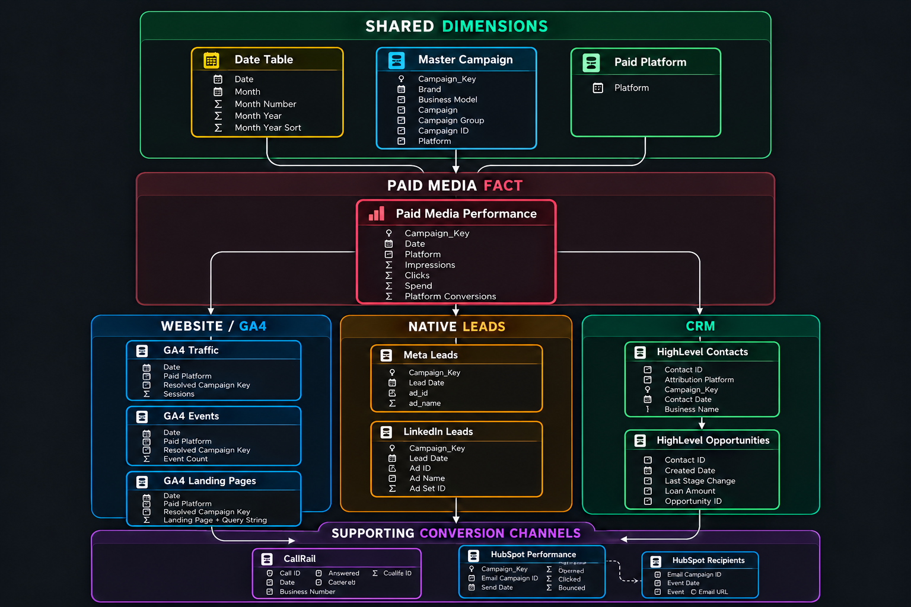
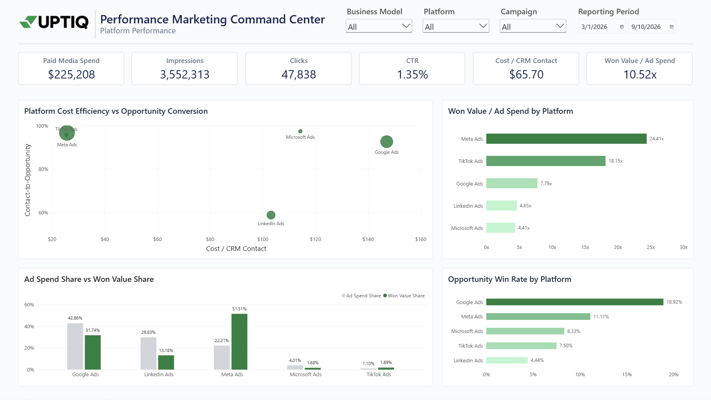
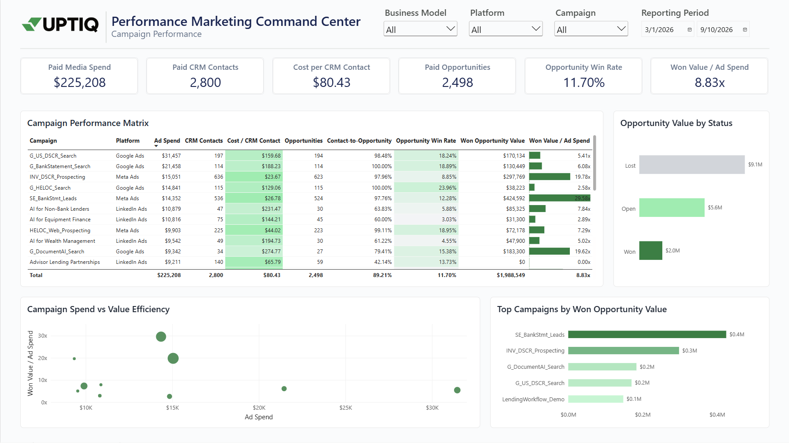
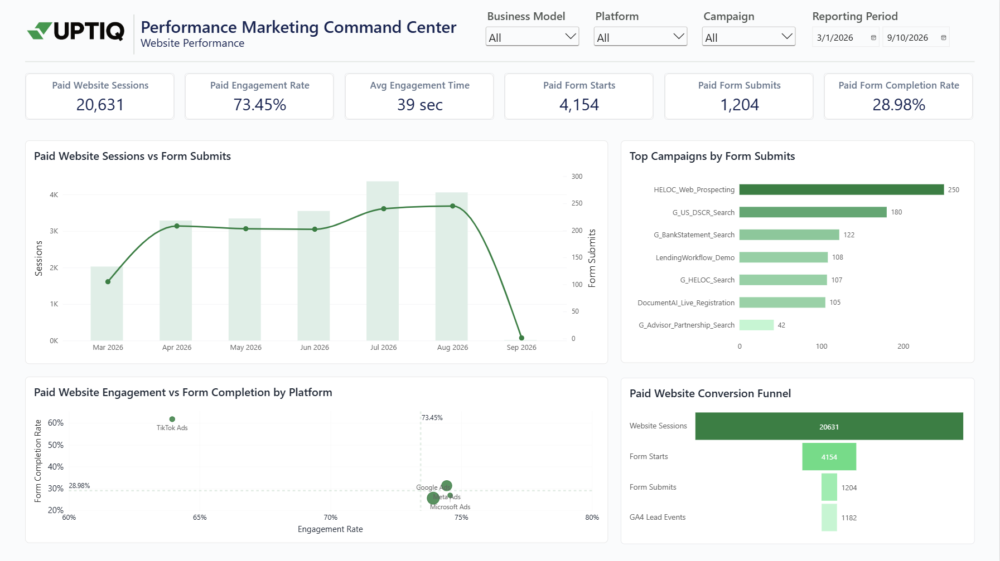
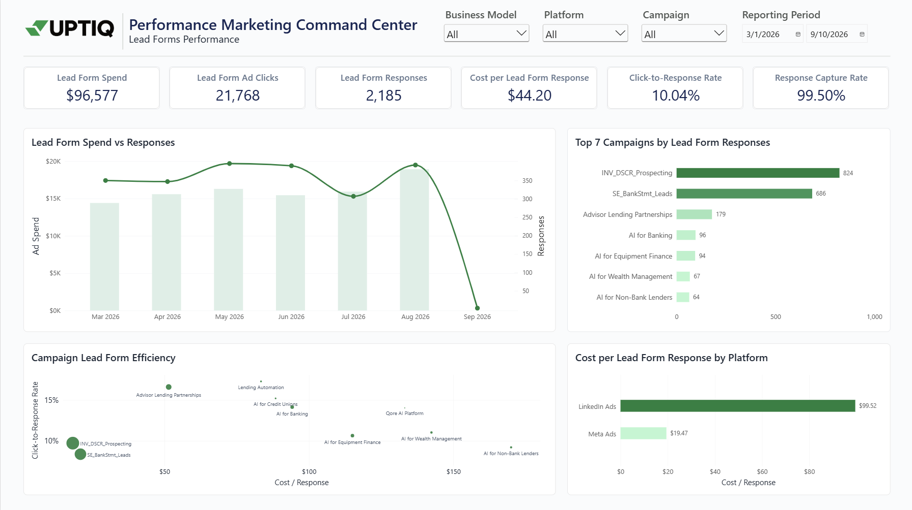
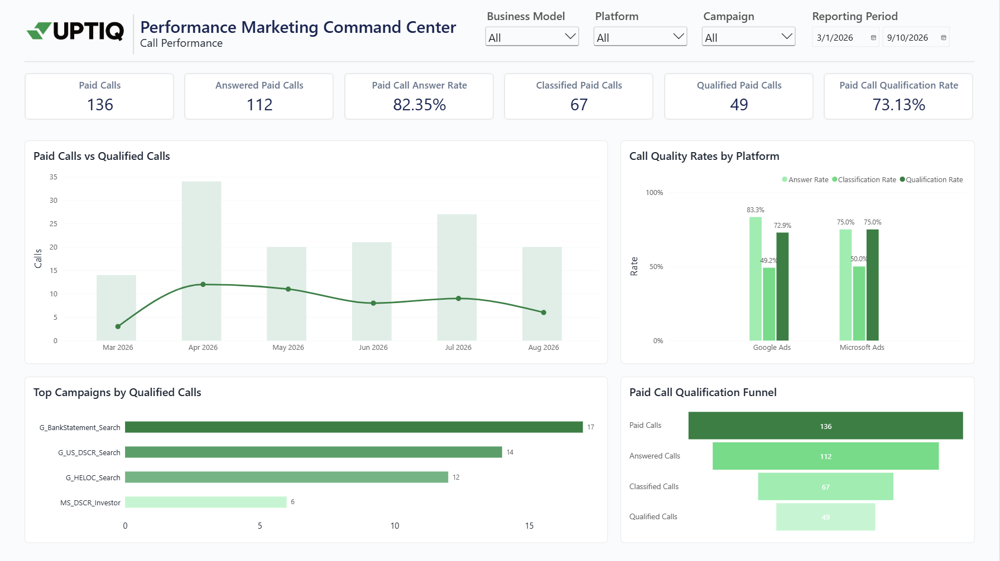
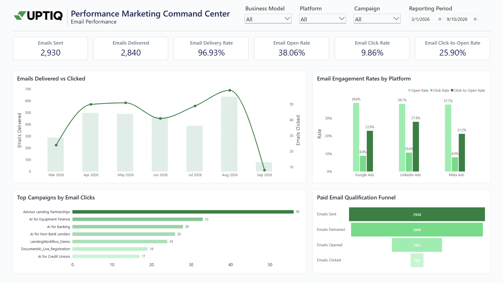

# UPTIQ Performance Marketing Command Center

**Power BI | Power Query | DAX | Marketing Analytics | Data Modelling**

An end-to-end performance marketing analytics project connecting paid media, website behaviour, CRM acquisition, native lead forms, phone enquiries and email nurture with downstream opportunity value.



**[View Interactive Power BI Dashboard →]([YOUR_PUBLIC_POWER_BI_LINK](https://app.powerbi.com/groups/me/reports/c8f75b82-ca7d-41a8-a1f9-158d2a52b631/67cab52770ab7980633c?experience=power-bi))**

> **Note:** This is an independent portfolio project built using simulated datasets informed by publicly available information about UPTIQ and published marketing case studies. It does not contain UPTIQ's confidential or actual internal performance data.

---

## Project at a Glance

| KPI | Result |
|---|---:|
| **Paid Media Spend** | **$225,208** |
| **Paid CRM Contacts** | **3,428** |
| **Paid Opportunities** | **3,043** |
| **Won Opportunities** | **291** |
| **Paid Opportunity Value** | **$20.27M** |
| **Won Opportunity Value** | **$2.37M** |
| **Won Opportunity Value / Ad Spend** | **10.52x** |
| **Paid Website Sessions** | **20,631** |
| **Native Lead Form Responses** | **2,185** |
| **Paid Calls** | **136** |

The dashboard was designed to answer one central question:

> **Are the platforms and campaigns generating the most clicks and leads also generating the strongest downstream business outcomes?**

---

# Business Problem

Performance marketing data often sits across multiple systems. Advertising platforms report spend and conversions, GA4 captures website behaviour, CRM systems contain contacts and opportunities, CallRail records phone enquiries, and HubSpot tracks nurture activity.

When these sources are analysed separately, teams can easily optimize toward clicks, low-cost leads or platform-reported conversions without knowing whether those users later become valuable opportunities.

I designed this project around that fragmentation problem and created a unified reporting layer that follows performance further down the funnel:

```text
Ad Spend
   ↓
Traffic / Native Response
   ↓
CRM Contact
   ↓
Opportunity
   ↓
Won Opportunity
   ↓
Opportunity Value
```

---

# Key Findings

## 1. Meta significantly outperformed LinkedIn on downstream value

LinkedIn looked reasonably strong at the lead-generation stage. It reported approximately **680 platform conversions**, while the Lead Gen response data contained around **675 genuine non-test responses**.

However, roughly **$67K in LinkedIn spend** generated only about **$312K in won opportunity value**, resulting in approximately:

**4.65x Won Opportunity Value / Ad Spend**

Meta showed a very different picture. Approximately **$50K in Meta spend** generated about **$1.22M in won opportunity value**, resulting in roughly:

**24.4x Won Opportunity Value / Ad Spend**

This showed why evaluating channels only on platform conversions could have produced a very different budget decision.

---

## 2. A high CTR did not automatically mean strong commercial efficiency

Google Ads generated roughly a **6.9% CTR**, substantially higher than Meta's approximately **1% CTR**.

However, Google's Cost per CRM Contact was around **$147**, and its Won Opportunity Value / Ad Spend was approximately **7.8x**.

Meta generated much lower click-through rates but substantially stronger downstream economics, demonstrating why upper-funnel engagement metrics should not be evaluated in isolation.

---

## 3. Native lead forms changed how LinkedIn performance should be interpreted

LinkedIn showed very little website-form activity compared with the number of Lead Gen responses and CRM contacts generated.

That was not necessarily a tracking failure because many users followed a completely different conversion path:

```text
LinkedIn Ad
      ↓
LinkedIn Lead Gen Form
      ↓
CRM Contact
```

A website-only reporting model would therefore have undervalued LinkedIn's contribution.

---

## 4. Low-volume efficiency needs to be interpreted carefully

TikTok produced approximately **18x Won Opportunity Value / Ad Spend** in the simulated analysis.

However, the platform had only around **$2.5K in spend**, which was substantially lower than Google, Meta or LinkedIn.

I therefore treated TikTok's result as **promising but not conclusive**, because strong efficiency at low scale does not guarantee that the same performance will continue after significant budget increases.

---

# What I Built

I created a seven-page Power BI command center integrating simulated/native-style data structures representing:

- Google Ads
- Meta Ads
- Microsoft Ads
- LinkedIn Ads
- TikTok Ads
- Google Analytics 4
- HighLevel CRM
- CallRail
- HubSpot

The report combines paid-media performance with website behaviour, CRM progression, opportunity value, native lead forms, phone enquiries and nurture activity.

The objective was not simply to visualize advertising metrics. The objective was to create an analytical model capable of comparing **media performance with downstream business outcomes**.

---

# Research Foundation

Before designing the project, I researched UPTIQ's publicly visible marketing environment and acquisition journeys.

Two published performance marketing case studies were particularly useful:

### GrowthSpree
**Uptiq.ai ABM Engine for Modern Financial Leaders**

This helped provide context around UPTIQ's B2B acquisition activity across financial-services audiences such as banks, credit unions, wealth-management firms and lending businesses.

### FiComm Partners
**UPTIQ Lending Campaign**

This provided context around lending acquisition involving paid social, landing pages, downloadable content and email nurture.

These sources were used to understand realistic business journeys and campaign structures. The analytical datasets used in this project were independently simulated.

---

# Data Sources Modelled

| Source | What it represents |
|---|---|
| **Google Ads** | Search campaign delivery, clicks, spend and conversions |
| **Meta Ads** | Paid social performance and native lead forms |
| **Microsoft Ads** | Paid-search acquisition |
| **LinkedIn Ads** | B2B campaign performance and Lead Gen Forms |
| **TikTok Ads** | Paid social acquisition |
| **Google Analytics 4** | Website sessions, engagement and conversion events |
| **HighLevel CRM** | Contacts, companies and opportunities |
| **CallRail** | Paid phone enquiries and call qualification |
| **HubSpot** | Email delivery, opens, clicks and nurture engagement |

The underlying datasets are intentionally **not included in this public repository**. The repository is intended to showcase the analytical methodology, data model, dashboard design and business insights.

---

# Data Model



Instead of merging every source into one large flat table, the model preserves different business processes at their natural grain and connects them using shared dimensions.

The three most important dimensions are:

### Date Table

Provides one consistent reporting calendar across multiple data sources.

### Paid Platform

Provides a shared platform dimension for:

```text
Google Ads
Meta Ads
Microsoft Ads
LinkedIn Ads
TikTok Ads
```

### Master Campaign

Provides shared campaign context including:

```text
Business Model
Campaign Group
Campaign ID
Campaign Key
Campaign
Platform
```

The model primarily uses **one-to-many, single-direction relationships** to keep filter propagation predictable and reduce ambiguous paths.

---

# Key Technical Decisions

## 1. Standardized five advertising platforms into one fact table

Google, Meta, Microsoft, LinkedIn and TikTok use different schemas and metric names.

I created platform-specific Power Query staging queries and standardized common fields such as:

```text
Date
Platform
Campaign Key
Campaign
Impressions
Clicks
Spend
Platform Conversions
```

The standardized records were then appended into a consolidated:

**Paid Media Performance**

fact table.

This allows the same DAX measures to work consistently across all five advertising platforms.

---

## 2. Created a composite Campaign Key

Campaign IDs are generated independently by each advertising platform, so a numeric Campaign ID alone is not guaranteed to be globally unique.

I created a composite key using:

```text
Platform + Campaign ID
```

For example:

```text
Google Ads|2322107359
Meta Ads|140863354893036
LinkedIn Ads|337732116
```

This created a reliable cross-platform campaign relationship key.

---

## 3. Separated platform attribution from campaign attribution

One of the most important modelling decisions was recognizing that knowing the platform does not always mean knowing the exact campaign.

For example:

```text
Platform = LinkedIn Ads
Campaign = Unknown
```

can still be a valid paid-media record.

The model therefore keeps:

```text
Paid Platform
= Which platform generated the activity?

Master Campaign
= Which exact campaign generated the activity?
```

separate.

This prevents valid platform-level activity from disappearing simply because exact campaign attribution is unavailable.

---

## 4. Resolved CRM attribution inconsistencies

HighLevel contained source and campaign information that did not always align perfectly with advertising-platform identifiers.

Power Query helper fields were created for:

```text
Attribution_Platform
Campaign_Key
Contact_Date
LinkedIn Campaign Key
Resolved Campaign Key
```

LinkedIn required an additional mapping step because its identifiers inside HighLevel did not consistently align with the campaign IDs used in the campaign dimension.

---

## 5. Preserved different conversion routes

The project deliberately avoids assuming every marketing conversion happens through a website form.

Different journeys are analysed separately:

```text
Paid Ad → Website → Form → CRM

LinkedIn Ad → Native Lead Form → CRM

Meta Ad → Native Lead Form → CRM

Google / Microsoft Ad → Phone Call

CRM Contact → Opportunity → Won Opportunity
```

This prevents website-only measurement from undervaluing native lead forms or phone conversions.

---

# Dashboard

## 1. Executive Overview


The Executive Overview gives management a consolidated view of the paid-acquisition funnel, moving from advertising investment through CRM contacts, opportunities and won opportunity value.

It is designed to answer:

> **How much are we spending, what business outcomes are we generating, and how efficiently is paid media creating downstream value?**

---

## 2. Platform Performance



This page compares Google, Meta, LinkedIn, Microsoft and TikTok using both advertising efficiency and downstream CRM performance.

It helps answer whether the platforms receiving the most budget are also producing the strongest CRM and opportunity outcomes.

---

## 3. Campaign Performance



The Campaign Performance page provides a deeper diagnostic view of individual campaigns.

It combines spend, CRM acquisition, opportunities, win rates and opportunity value to identify campaigns that may look strong at the advertising level but perform differently further down the funnel.

Campaign reporting intentionally uses stricter attribution than platform reporting because records without a reliable campaign mapping are not artificially assigned to a campaign.

---

## 4. Website Performance



The Website Performance page analyses what happens after paid users reach the website.

It evaluates:

- Paid website sessions
- Engagement quality
- Average engagement time
- Form starts
- Form submissions
- Form completion rate

The page helps identify whether conversion problems originate from traffic quality, engagement or form completion.

---

## 5. Lead Forms Performance



This page analyses Meta and LinkedIn native lead-generation activity separately from website conversions.

It compares:

- Lead form spend
- Ad clicks
- Actual captured responses
- Cost per response
- Click-to-response rate
- Platform response capture

This separation was necessary because native Lead Gen Forms can generate CRM contacts without generating GA4 website-form activity.

---

## 6. Call Performance



The Call Performance page captures another conversion route that would be missed by website-only reporting.

The call funnel follows:

```text
Paid Calls
    ↓
Answered Calls
    ↓
Classified Calls
    ↓
Qualified Calls
```

This helps determine whether advertising campaigns are generating meaningful phone enquiries rather than simply call volume.

---

## 7. Email Performance



The Email Performance page analyses nurture engagement after acquisition.

The final email funnel follows:

```text
2,930 Sent
    ↓
2,840 Delivered
    ↓
1,081 Opened
    ↓
280 Clicked
```

This produced:

- **96.93% Delivery Rate**
- **38.06% Open Rate**
- **9.86% Click Rate**
- **25.90% Click-to-Open Rate**

Recipient-level event logic was used to prevent repeated opens or clicks from artificially inflating engagement.

---

# Additional Funnel Insights

## Website Funnel

The website analysis produced:

```text
20,631 Paid Website Sessions
          ↓
4,154 Form Starts
          ↓
1,204 Form Submits
```

The resulting Paid Form Completion Rate was approximately:

**28.98%**

This helps separate the challenge of getting users to engage with the form from the challenge of getting users who started the form to complete it.

---

## Native Lead Forms

Meta and LinkedIn together generated:

**2,185 actual Lead Form Responses**

compared with:

**2,196 platform-reported lead-form conversions**

This resulted in a Lead Form Response Capture Rate of approximately:

**99.50%**

The comparison helps validate whether downstream captured response data reconciles with platform reporting.

---

## Paid Calls

The paid-call funnel produced:

```text
136 Paid Calls
      ↓
112 Answered
      ↓
67 Classified
      ↓
49 Qualified
```

This resulted in:

- **82.35% Paid Call Answer Rate**
- **73.13% Qualification Rate among classified calls**

Calls were intentionally kept separate from CRM Contacts because the same individual could potentially appear in both datasets.

---

# Why I Did Not Call the Main Efficiency Metric ROAS

The project includes:

**Won Opportunity Value / Ad Spend = 10.52x**

However, I intentionally did not label this metric as ROAS.

The numerator represents CRM **opportunity value**, not verified recognized revenue.

Calling it ROAS would therefore imply a level of financial certainty that the available data does not support.

This distinction was important for keeping the dashboard analytically transparent.

---

# Limitations

This project uses simulated rather than internal production data, so the findings demonstrate analytical methodology rather than UPTIQ's actual business performance.

Other limitations include:

- Opportunity Value is not the same as recognized revenue.
- Platform attribution is more complete than exact campaign attribution.
- GA4 form-start metrics are based on event counts rather than unique session identifiers.
- Low-spend platform performance may not remain stable at larger scale.
- Static source extracts were used instead of automated production pipelines.

---

# Future Improvements

With production system access, the next improvements I would prioritize are:

- Replace static extracts with automated API or warehouse pipelines.
- Integrate recognized revenue or funded-loan data for true CAC and ROAS analysis.
- Add cohort, LTV and retention analysis.
- Extend attribution beyond first-touch campaign reporting.

---

# Tech Stack

**Power BI Desktop**  
**Power Query**  
**DAX**  
**Google Analytics 4 concepts**  
**HighLevel CRM concepts**  
**HubSpot email data**  
**CallRail call-tracking data**  
**GitHub**

---

# Repository Structure

```text
UPTIQ-Performance-Marketing-Command-Center/
│
├── README.md
│
└── assets/
    ├── 01_Executive_Overview.png
    ├── 02_Platform_Performance.png
    ├── 03_Campaign_Performance.png
    ├── 04_Website_Performance.png
    ├── 05_Lead_Forms_Performance.png
    ├── 06_Call_Performance.png
    ├── 07_Email_Performance.png
    └── 08_Data_Model.png
```

The raw datasets and working Power BI model are intentionally not included in this public repository.

This repository is designed to showcase:

```text
Business Problem
      ↓
Data Integration
      ↓
Data Modelling
      ↓
DAX & KPI Development
      ↓
Dashboard Design
      ↓
Business Analysis
```

---

# Project Disclaimer

This is an **independent educational and portfolio project**.

The datasets used in the project are simulated and were created using publicly available information about UPTIQ's business environment and published marketing case studies as contextual references.

The repository does **not** contain confidential, proprietary or actual internal UPTIQ customer, CRM, advertising or financial data.

All numerical findings shown in the dashboard belong exclusively to the simulated portfolio dataset.

---

# Author

## Prakash Singh

**Data Analytics | Business Intelligence | Marketing Analytics**

GitHub: **@prakash0-0singh**
